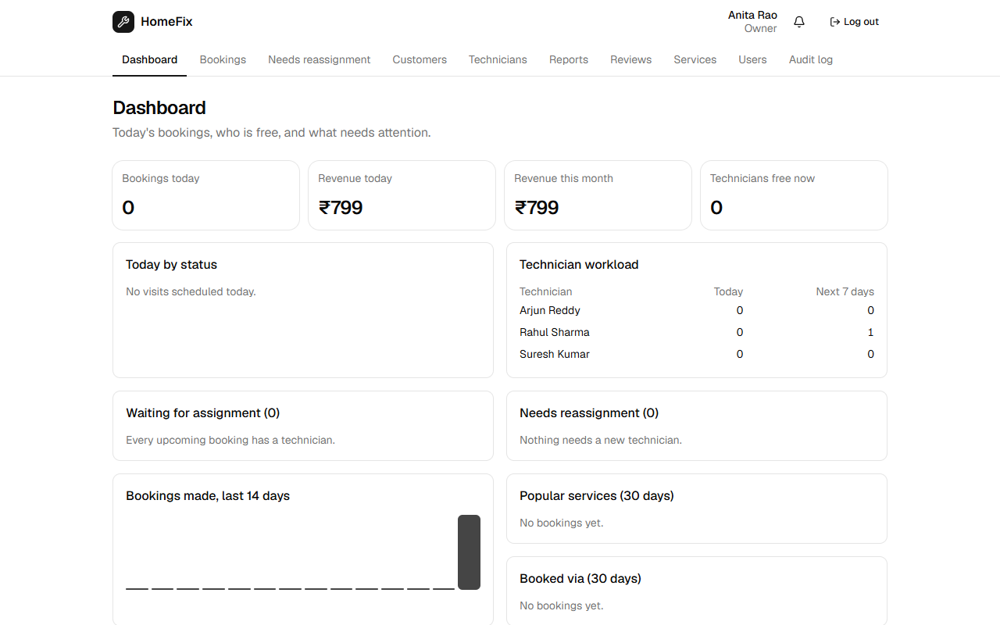
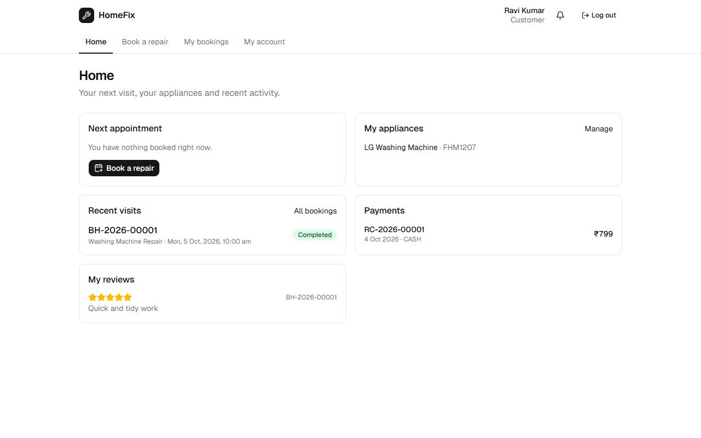
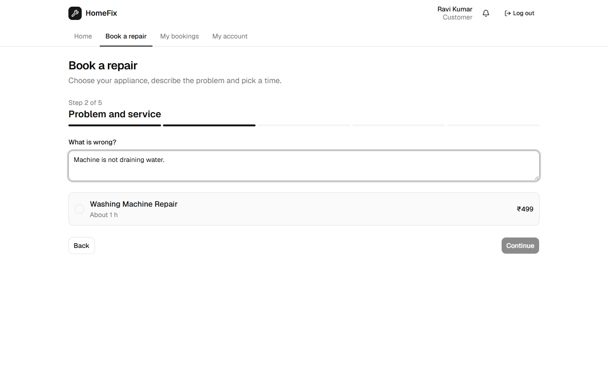
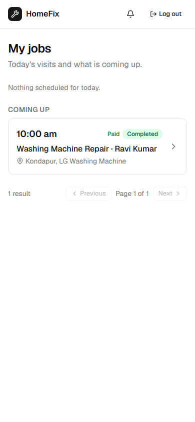
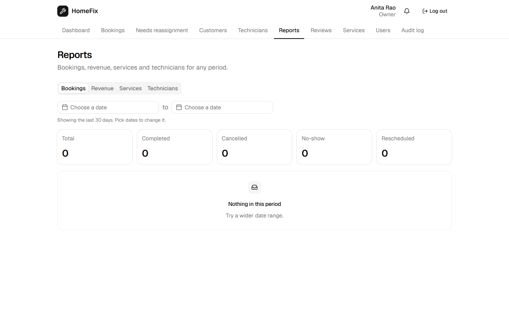
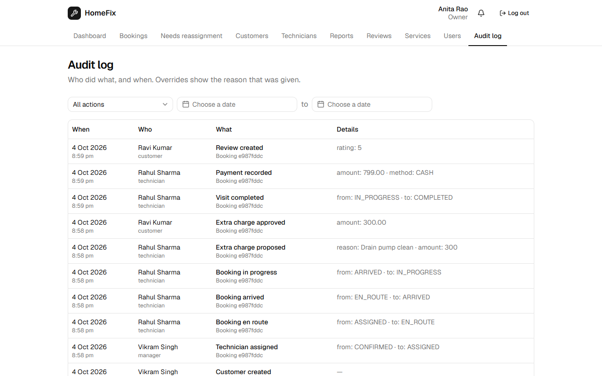

# BusinessHub (frontend)

Next.js UI for **HomeFix Appliance Services** (Hyderabad): appliance repair booking and field service. Three experiences
in one app: **customers** book and follow their repairs, **staff** (Owner and Manager) run the day, and **technicians**
work their jobs from a phone.

**Live demo:** _add the Vercel URL here after deploying_ · **Backend repo and API docs:** https://github.com/saierukala/businesshub-backend

The backend is the source of truth. This app only shows what the API returns and sends requests: it never decides
availability, prices or which status changes are allowed.

| Staff dashboard | Customer home | Booking wizard |
| --- | --- | --- |
|  |  |  |

| Technician (phone) | Reports | Audit log |
| --- | --- | --- |
|  |  |  |

## What is in it
- **Customer:** book in 5 steps (appliance, problem and service, address, date and time, review), reschedule and cancel, approve extra charges, receipts, ratings, home dashboard, appliance history.
- **Staff:** dashboard (today by status, pending assignments, revenue, workload), bookings on behalf of phone customers, assignment and the "needs reassignment" queue, customers, technicians (skills, areas, hours, time off), service catalog, users, reports (bookings, revenue, services, technicians), reviews, and the Owner-only audit log.
- **Technician (mobile first):** today's jobs, big one-hand buttons (on my way, arrived, start), visit notes, extra charge proposal, payment, receipt.
- Notification bell, loading / empty / error states on every data screen, light and dark mode.

Stack: Next.js 16 (App Router), React 19, TypeScript, Tailwind v4, shadcn/ui, TanStack Query, React Hook Form + Zod, Vitest + Testing Library, Playwright.

## Run it locally
You need the backend running first (see its README): API on port 4000, seeded.

```bash
npm install
cp .env.example .env     # BACKEND_URL=http://localhost:4000
npm run dev              # http://localhost:3000
```

Every call goes to `/api/*` on this app, which `next.config.ts` rewrites to `BACKEND_URL`. That keeps the httpOnly login cookie on one origin.

Demo logins (password `Password@123` for all): `owner@homefix.test`, `manager@homefix.test`, `rahul@homefix.test` (technician), `ravi@example.test` (customer).

## Commands
| Command | What |
| --- | --- |
| `npm run dev` / `npm run build` / `npm start` | Develop / production build / run it |
| `npm run lint` / `npm run typecheck` / `npm test` | ESLint / TypeScript / Vitest |
| `npx playwright test` | End-to-end tests (below) |

## End-to-end tests
Two tests, one per path from the project spec, in a real browser against the real API and PostgreSQL:
- `e2e/customer-path.e2e.ts`: Ravi books, a manager assigns Rahul, Rahul works the job and proposes ₹300 extra, Ravi approves, Rahul completes it and records ₹799, Ravi rates it. It also checks that the same technician cannot be booked twice for that time.
- `e2e/staff-path.e2e.ts`: the manager creates a phone-only customer and books for her (source PHONE), marks the technician sick, sees the booking flagged, and reassigns it.

```bash
# needs the backend repo next to this one (or BACKEND_DIR=path) and a local PostgreSQL
npx playwright install chromium          # once (or use your installed Edge: E2E_CHANNEL=msedge)
npx playwright test
```

The run starts its own API (port 4100) and this app (port 3100) against a separate database named `businesshub_e2e`
(derived from the backend's `.env`, or set `E2E_DATABASE_URL`). The database is **emptied and re-seeded before every run**,
and the reset refuses any database whose name does not contain "e2e". `E2E_VIDEO=1` records both paths as video;
`SCREENSHOTS=1 npx playwright test e2e/customer-path.e2e.ts e2e/screenshots.e2e.ts` retakes the README screenshots.

CI (`.github/workflows/ci.yml`) runs lint, typecheck, unit tests and the build, then the two E2E tests with a PostgreSQL service
(it checks out the backend repo; if that repo is private add a read-only token as the secret `BACKEND_REPO_TOKEN`).

## Deploying
See the backend repo's `docs/DEPLOY.md`. On Vercel the only setting is `BACKEND_URL` (the API's public URL).

## More
Short notes per feature are in `docs/` (bookings, visits, payments, notifications, dashboards and reports, reviews, audit and hardening).
Browser hardening headers are set in `next.config.ts`.
